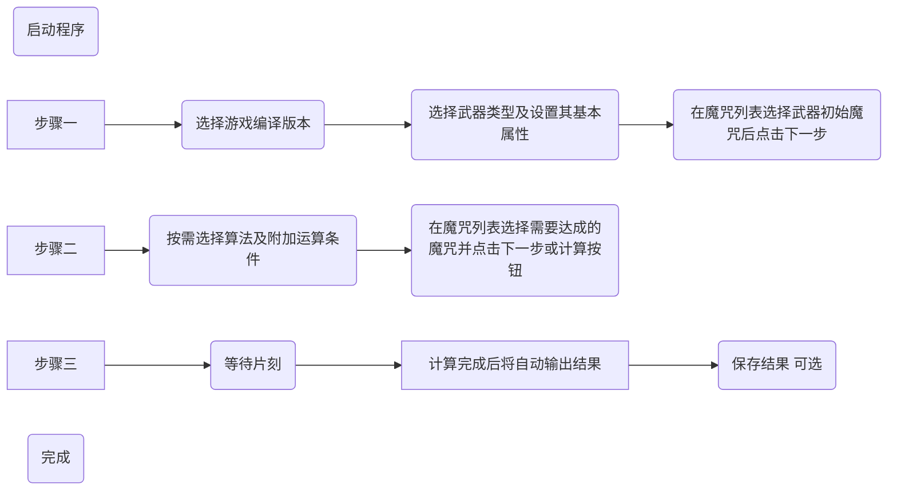

>***本软件程序是安全无毒、完全开源免费的！大家只需要根据这里或[此视频](https://www.bilibili.com/video/BV11T4y1D7c2)的获取方式获取使用即可！任何对本软件进行收费、出售等行为均为诈骗，大家谨防上当！并且也不要轻易使用不明身份的陌生人提供的第三方软件，谨防病毒入侵！***

# 最佳附魔顺序计算器（The Best Enchanting Sequence）

## 简介
这是一个可以帮助你在附魔的时候轻松降低附魔成本的小程序。

+ 众所周知，在原版Minecraft中我们可以通过附魔台和铁砧给物品附魔，以增强它们的属性。但是，由于游戏设计限制，我们并不能轻易地打造出一件令我们满意的附魔属性强大的神器。尤其是当使用铁砧进行附魔的时候，不仅经验花费巨大，更棘手的是操作多次后还会由于过于昂贵而无法继续操作，若你没能把握住这个规律，你需要的附魔往往就不能全部实现。因此，本程序应运而生。你可以通过它轻易地计算出一条可行的低成本的路径来实现你想要的附魔，打造出你想要的神器。

注意：这个项目仍在开发中，功能尚未完善，但已经能用了。由于作者学业繁忙，剩下的功能可能要推迟到以后（至少高考后）慢慢更新完善。如果你有什么建议或发现了BUG，请联系我或反馈到这里来，谢谢！

+ 现已支持Java版和基岩版！

## 功能介绍&使用方法

### 主要特性

+ 支持锻造附魔流程计算
+ 支持锻造附魔成本计算
+ 支持自定义武器
+ 支持自定义魔咒
+ 支持计算初始带有魔咒的物品
+ 支持Java版和基岩版
+ 精细的UI界面

### 使用方法

1. UI功能区介绍

<table>
 <tr>
  <th>窗口</th>
  <th>分区</th>
  <th>功能</th>
 </tr>
 <tr>
  <td rowspan="3" align="center">主窗口</td>
  <td align="center">菜单栏</td>
  <td>基本命令：设置、快速添加自定义项、软件信息等</td>
 </tr>
 <tr>
  <td align="center">步骤页面</td>
  <td>游戏编译版本选择及武器种类选择 魔咒列表：匹配武器的初始魔咒 算法选择及附近运算条件 魔咒列表：选择武器需求的魔咒 计算及结果输出</td>
 </tr>
 <tr>
  <td align="center">状态栏</td>
  <td>（公告或声明）</td>
 </tr>
 <tr>
  <td rowspan="3" align="center">设置窗口</td>
  <td align="center">默认值设置</td>
  <td>设置启动时默认选择的游戏编译版本 设置启动时默认选择的算法 设置默认导出位置</td>
 </tr>
 <tr>
  <td align="center">功能设置</td>
  <td>自定义武器 自定义魔咒 启动时自动检查更新</td>
 </tr>
 <tr>
  <td align="center">更多设置</td>
  <td>手动检查更新 问题反馈 关于</td>
 </tr>
</table>

2. 基本使用流程

3. 自定义功能
   + **使用自定义功能时需要打开相应的自定义功能开关，可转到程序的设置窗口进行开启**
   + 自定义武器

     1. 在程序目录新建文件为`WeaponTable.csv`（注意扩展名，已存在可跳过）
     2. 使用Microsoft Excel或其他支持的软件打开上述文件
     3. 按以下格式将自定义武器的信息逐行填入表格：
    
        | 武器名	| 武器图标地址（可留空） |
        | ---- | ---- |
        
        > 注意，武器图标引用本地文件，地址中的反斜杠`\`需变为正斜杠`/`。
       
        如：
        | 剑	| D:/res/netherite_sword.png |
        | ---- | ---- |
     4. 保存为`CSV UTF-8 逗号分隔符`格式并退出编辑软件

   + 自定义魔咒

     1. 在程序目录新建文件为`EnchantmentTable.csv`（注意扩展名，已存在可跳过）
     2. 使用Microsoft Excel或其他支持的软件打开上述文件
     3. 按以下格式将自定义武器的信息逐行填入表格：
    
        | 魔咒名（ID）	| 魔咒次最高等级 | 魔咒最高等级 | 物品乘数 | 附魔书乘数 | 支持的游戏编译版本（0：全部，1：仅JE，2：仅BE） | 冲突的魔咒（多个值使用`\|`分隔） | 是否合适1号武器（0：否，1：是） | 是否合适2号武器 | ... | 是否合适n号武器 |
        | ---- | ---- | ---- | ---- | ---- | ---- | ---- | ---- | ---- | ---- | ---- |
       
        > 其中，`n号武器`中的编号由自定义武器列表决定，由上至下从1号开始编号，每种武器（每个有效行）一个编号，当没有启用自定义武器功能时则由内置武器顺序决定序号，由先到后从1号开始编号，见程序`步骤一`页面。

        如：
        | 锋利 |	4	| 5 |	1 |	1 |	0 |	节肢杀手\|亡灵杀手 |	1 |	0 |	1 |	0 |	0 |	0 |	0 |	0 |	0 |	0 |	0 |	0 |	0 |
        | -- | -- | -- | -- | -- | -- | -- | -- | -- | -- | -- | -- | -- | -- | -- | -- | -- | -- | -- | -- |
     4. 保存为`CSV UTF-8 逗号分隔符`格式并退出编辑软件

## 开发计划简报

重写的全新版本v4.2计划在2023年8月期间完成，计划实现以下**特性**：

+ 【使前后端独立】将核心功能方法独立出来，聚合成一个独立计算核心，大幅降低核心功能与其它模块的耦合度，同时提高计算的效率
+ 【重写算法】通过新的数学模型建立新的算法模型，优化算法，使其支持更高级的物品配置策略，如武器附魔，附魔书合成，自由合成等
+ 【重新设计文件数据结构】如武器池文件、魔咒池文件等
+ 【重写GUI】使用全新的UI设计（*关键还是要好用*）
+ 【提供CMD/Console版本】可在命令行使用命令直接进行计算和结果输出等操作，也可以以控制台模式启动，能在DOS窗口中进行交互 ~~（朴实无华）~~
+ 【添加小工具】在GUI完整版中提供一些小工具来辅助附魔、计算等
+ 【实装快速自定义功能】实现在GUI中快捷编辑自定义列表，并可对自定义列表进行分组按需应用 ~~（整合包玩家狂喜）~~
+ 【多语言支持】程序默认提供 English、简体中文、繁体中文和文言，有其它语言需要的可导入第三方翻译文件
+ 【更多魔咒功能】惩罚消除魔咒、一次性魔咒等

## 参考资料 & 鸣谢

+ [铁砧机制 - Minecraft Wiki](https://minecraft.fandom.com/zh/wiki/%E9%93%81%E7%A0%A7%E6%9C%BA%E5%88%B6)
+ [F13-怎么给你的武器装备用最佳顺序附魔？ - 肥啾U_ruby](https://www.bilibili.com/read/cv14725362)
+ [[Minecraft]最优化附魔顺序攻略 - hqqaazz](https://www.bilibili.com/read/cv9565707)
+ [Anvil mechanics - Minecraft Wiki](https://minecraft.fandom.com/wiki/Anvil_mechanics)
+ [YueLengM (Github)](https://github.com/YueLengM)
+ [半只洛伊 (Bilibili)](https://space.bilibili.com/105384464)
+ 帮忙测试的群友们

